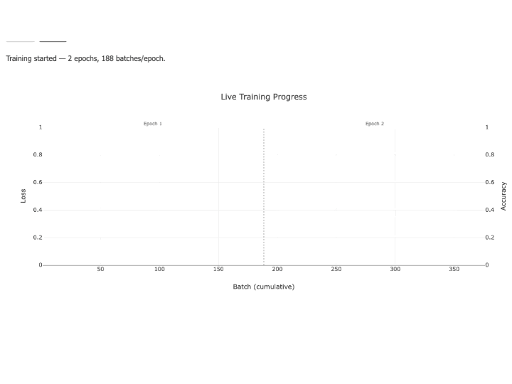

# CMAPSS-2: Turbofan Failure Prediction

An LSTM-based predictive-maintenance web app for NASA's C-MAPSS FD001 turbofan engine
dataset. Trains a failure-risk model on 100 simulated engine units, with training either
**Standard:** one-shot training, or **Live Training:** streaming per-batch
loss/accuracy to a chart as it happens, then lets you run predictions against held-out
units two ways: **Static** (one-shot, against a unit's full history) or **Dynamic** (a
live, cycle-by-cycle simulated stream, updating a chart in real time).

Please visit [guiderae/WorkingDemos-RealTimeGraph1](https://github.com/guiderae/WorkingDemos-RealTimeGraph1) 
for an explanation and demo of how to live stream data from the server to the browser 
and plot the graph browser side using the javascript version of plotly, plotly.js.

This web app uses the light weight Flask web frameworks to serve the content.  However, the code
presented in this has no Flask dependencies other than the controller that maps the incoming
URL requests to the relevant Python functions.  

## Prerequisites

- Python 3.11
- ~200MB free disk space (TensorFlow + dependencies)

## Setup

```bash
git clone https://github.com/guiderae/CMAPSS-2-RealTime.git
cd CMAPSS-2-RealTime

python3.11 -m venv venv
source venv/bin/activate        # Windows: venv\Scripts\activate

pip install -r requirements.txt
```

The dataset (`data/train_FD001.txt`, NASA C-MAPSS FD001 - 100 turbofan units, each run to
failure) is already included in the repo; no separate download needed.

## Running

```bash
venv/bin/python app.py
```

The server starts on **http://localhost:8082**. Open that URL in a browser.
**NOTE:**  You can change the port number in config.py in the class FlaskConfig.

## Usage

The app is a 4-step wizard:

1. **Data Preparation** - click **Prepare Data**. Loads all 100 engine units, selects the
   10 sensors most correlated with approaching failure, and builds training/test sequences.
   The split is percentage-based (`config.py`'s `DataConfig.TRAIN_UNIT_ALLOCATION` /
   `TEST_UNIT_ALLOCATION` / `PREDICT_UNIT_ALLOCATION`, default 70% / 20% / 10%), so with the
   100 units in `train_FD001.txt` that's units 1–70 for training, 71–90 for testing, and
   91–100 held out for prediction only.

2. **Model Training** - set epochs/learning rate, then choose a mode:
   - **Standard Training** - click **Train Model**. Trains the LSTM from scratch
     synchronously (a spinner shows while it runs); loss/accuracy curves are shown on
     completion.
   - **Live Training** - click **Start** to train in the background while a chart streams
     loss (left axis) and accuracy (right axis) live, batch by batch, with dotted markers
     and labels showing where each epoch starts. **Stop** halts training early (within
     about one batch). Only one training run - standard or live - can be in progress at a
     time; starting a second one, or trying to Predict/Test while training is running, is
     rejected with a clear error rather than corrupting the in-progress model.

3. **Test Model** - click **Test Model** to evaluate against the held-out test units, or
   **Skip Test & Proceed to Prediction** to go straight to predicting (testing is
   diagnostic, not required).

4. **Prediction** - pick an engine unit from the dropdown (units 91–100, the dedicated
   prediction-only units - never trained or tested on), then choose a mode:
   - **Static Prediction** - runs the model once against the unit's full history and shows
     the failure probability plus a plot.
   - **Dynamic Prediction** - click **Start** to stream the unit's sensor readings cycle by
     cycle (simulating live data arrival) into a chart with sensors on the left axis and a
     live failure-probability trace on the right axis. The probability trace stays empty
     for the first 30 cycles (the model needs that much history before it can predict
     anything), then begins tracking. **Stop** ends the stream early.

**Reset Application** (top right) clears all state - data, trained model, and any
results/charts on screen - back to step 1.

## Loss and Accuracy in real time as model is training:


## Prediction calculated and plotted in real time:


## Project structure

```
CMAPSS-2/
├── app.py                              Flask routes (thin controller - no business logic)
├── config.py                           All constants, grouped by concern
├── lstm_model.py                       LSTM architecture + the shared trained model instance + training_lock
├── managers/
│   ├── data_prep_manager.py            DataPrepManager - load/scale data, build train/test/predict unit splits
│   ├── train_manager.py                TrainManager - synchronous (Standard) training
│   ├── test_manager.py                 TestManager - evaluate against held-out test units
│   ├── predict_manager.py              PredictManager - Static Prediction for one unit
│   └── graph_manager.py                GraphManager - matplotlib plots (training/test/prediction) as base64 PNG
├── realtime/
│   ├── data_source_manager.py          DataSourceManager - paced row generator for Dynamic Prediction
│   ├── process_realtime_data.py        ProcessRealtimeData - buffers, predicts, formats SSE for Dynamic Prediction
│   ├── live_training_callback.py       LiveTrainingCallback - Keras Callback pushing per-batch stats to a queue
│   └── process_realtime_training.py    ProcessRealtimeTraining - background-thread fit() + SSE generator for Live Training
├── utils/
│   └── data_file_manager.py            DataFileManager - lists selectable prediction units
├── templates/index.html                The single-page wizard UI -- markup only, no inline JS/CSS
├── static/
│   ├── css/main.css                    All page styling
│   ├── js/
│   │   ├── main.js                     Wizard state/navigation + Data Prep, Standard Training, Test, Static
│   │   │                                Prediction, and Reset -- wires up its own buttons/radios on DOMContentLoaded
│   │   ├── realtime.js                 Browser-side EventSource + Plotly chart logic for Dynamic Prediction
│   │   └── live_training.js            Browser-side EventSource + Plotly chart logic for Live Training
│   └── images/                         Screenshots/recordings embedded above
│       ├── training1.png               Standard Training results (static screenshot)
│       ├── training4.gif               Live Training loss/accuracy streaming (animated, embedded above)
│       ├── prediction1.png             Prediction results (static screenshot)
│       └── prediction2.gif             Dynamic Prediction streaming live (animated, embedded above)
└── data/train_FD001.txt                NASA C-MAPSS FD001 dataset (100 engine units)
```

## Notes

- Training is not seeded to a fixed random state across processes in a way that guarantees
  bit-identical results between runs on different machines, but results within a run are
  reproducible (see `config.py`'s `ModelConfig.RANDOM_SEED`).
- The Flask dev server runs with `threaded=True` - required so a live Dynamic Prediction
  stream, or a Live Training run, doesn't block other requests (e.g. Reset) while it's
  running.
- `LSTMModel.training_lock` guards the shared model against concurrent access - Live
  Training runs `model.fit()` on a background thread, so Train/Test/Predict/Dynamic
  Prediction all check the lock first rather than reading or mutating the model while
  it's being retrained. This is a single-process `threading.Lock`, correct for how the
  app is run here; it would need a different mechanism under multiple worker processes
  (e.g. `gunicorn -w 2+`).
